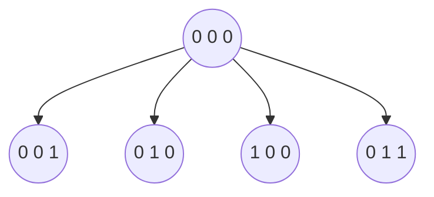

## Practica 1
1.. En este ejercicio vamos a resolver el problema de suma de subconjuntos con la técnica de back-tracking. Dado un multiconjunto C = {c1, . . . , cn} de números naturales y un natural k, queremos determinar si existe un subconjunto de C cuya sumatoria sea k. Vamos a suponer fuertemente que C está ordenado de alguna forma arbitraria pero conocida (i.e., C está implementado como la secuencia c1, . . . , cn o, análogamente, tenemos un iterador de C). Las *soluciones (candidatas)* son los vectores $a = (a_1, . . . , a_n)$ de valores binarios; el subconjunto de C representado por *a* contiene a ci si y sólo si ai = 1. Luego, a es una solución válida cuando $\sum_{i=1}^{n} a_i.c_i = k$ . Asimismo, una solución parcial es un vector $p = (a_1, . . . , a_i)$ de números binarios con 0 ≤ i ≤ n. Si i < n, las soluciones sucesoras de p son p ⊕ 0 y p ⊕ 1, donde ⊕ indica la concatenación.
****
	a) Escribir el conjunto de soluciones candidatas para C = {6, 12, 6} y k = 12.
	 $$A = \{(0,0,0), (0,0,1), (0,1,0), (0,1,1), (1,0,0), (1,0,1), (1,1,0), (1,1,1)\}$$
	b) Escribir el conjunto de soluciones válidas para C = {6, 12, 6} y k = 12.
	$$ V = \{(1,0,1), (0,1,0)\} $$
	c) Escribir el conjunto de soluciones parciales para C = {6, 12, 6} y k = 12.
	$$P = \{(0,0,0), (0,0,1), (0,1,0), (0,1,1), (1,0,0), (1,0,1), (1,1,0), (1,1,1), (0,0), (0,1), (1,0), (1,1), (0), (1)\}$$
	d) Dibujar el árbol de backtracking correspondiente al algoritmo descrito arriba para C = {6, 12, 6} y k = 12, indicando claramente la relación entre las distintas componentes del árbol y los conjuntos de los incisos anteriores.

